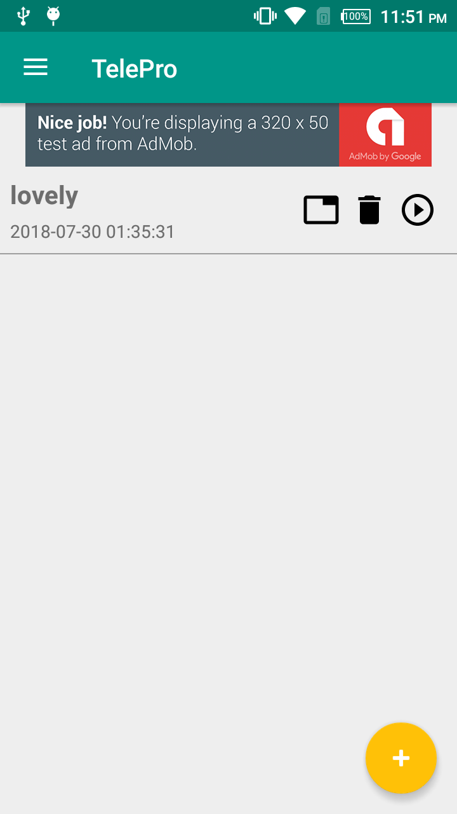
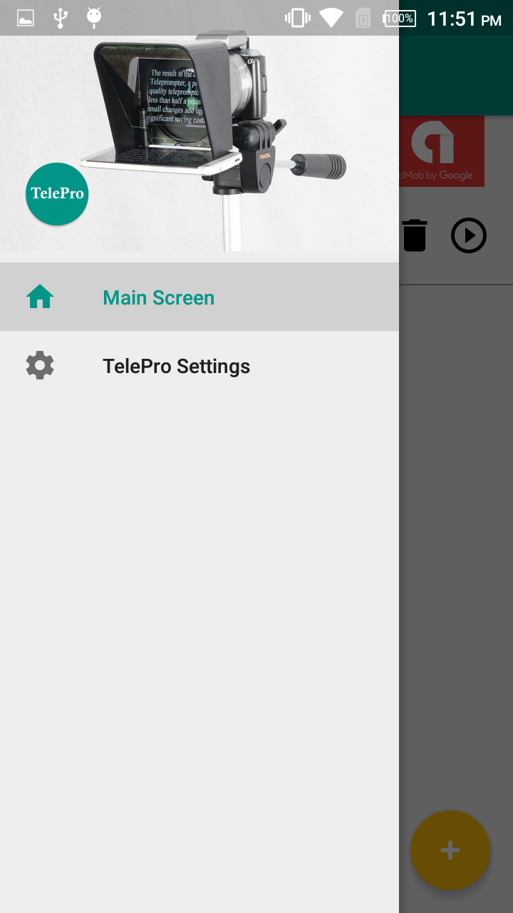
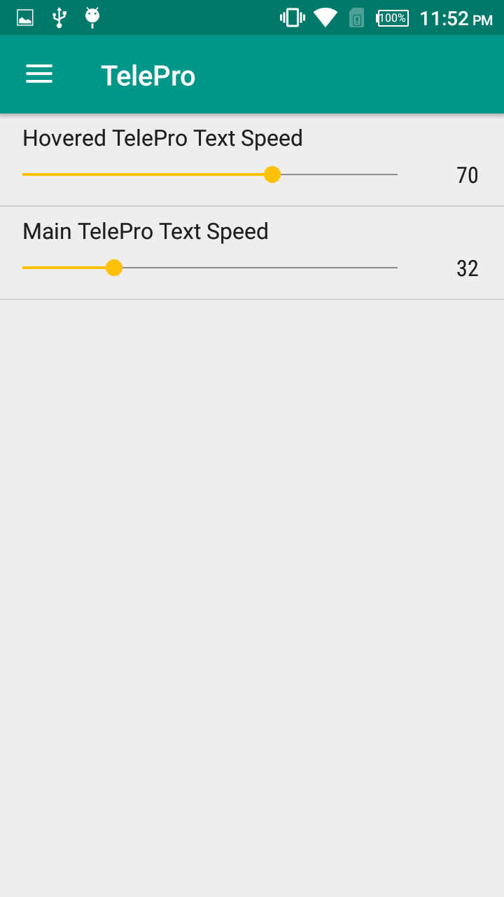
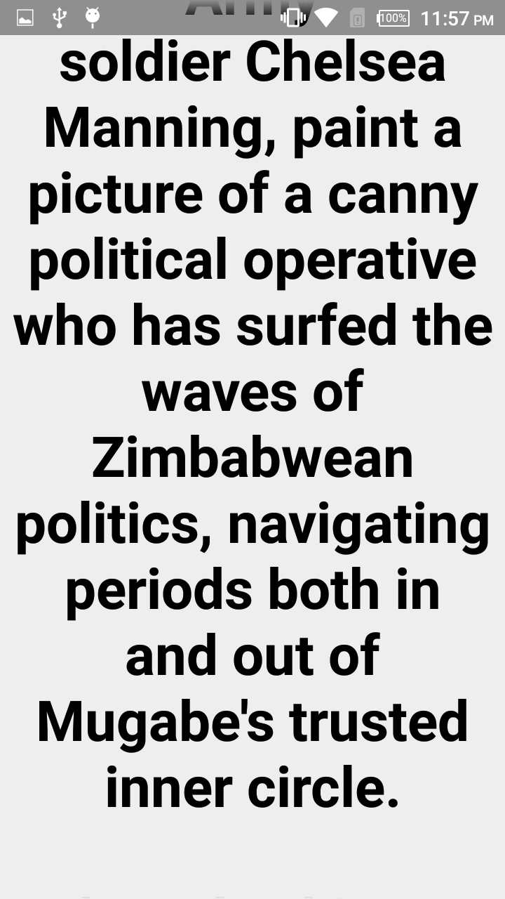
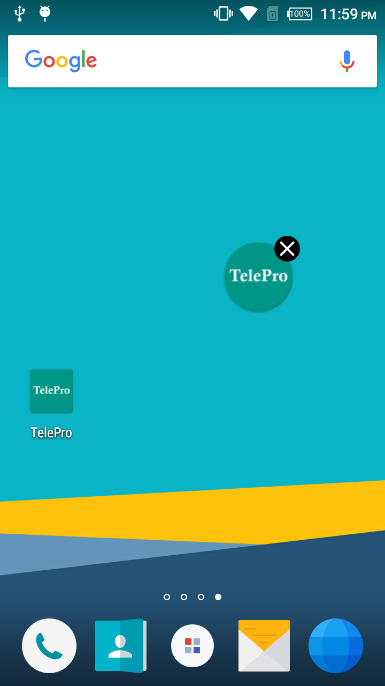

# Telepro - Teleprompter
Udacity Android Developer Nanodegree Capstone project.

## What the app do:
A simple teleprompter application, that you can use with any video recording or live video application, this app will help you to shine with confidence through all your videos recordings.

## App screenshots:
    

  
